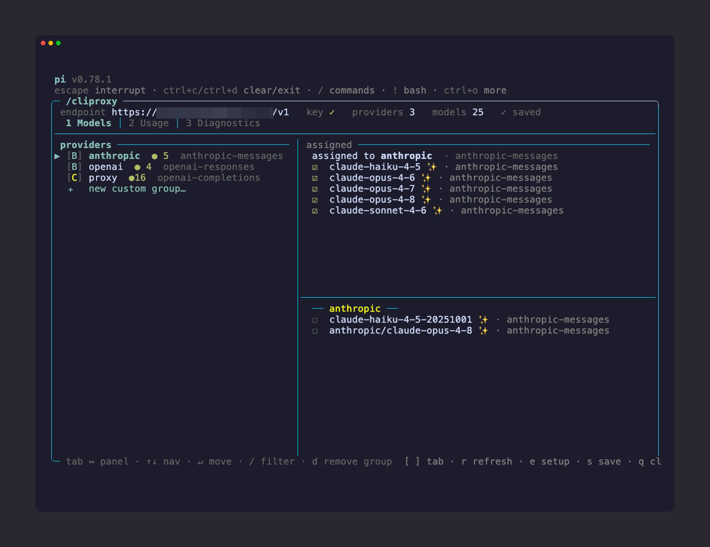
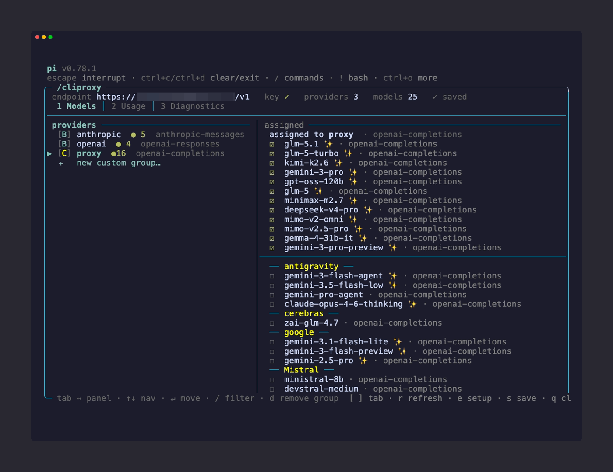
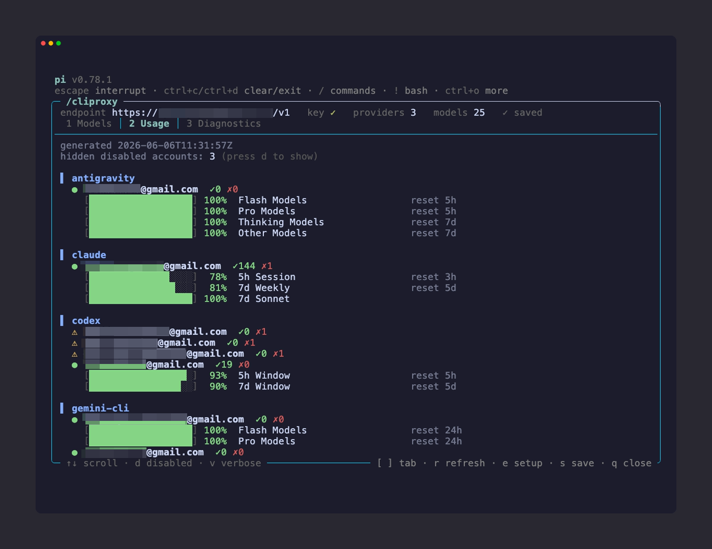
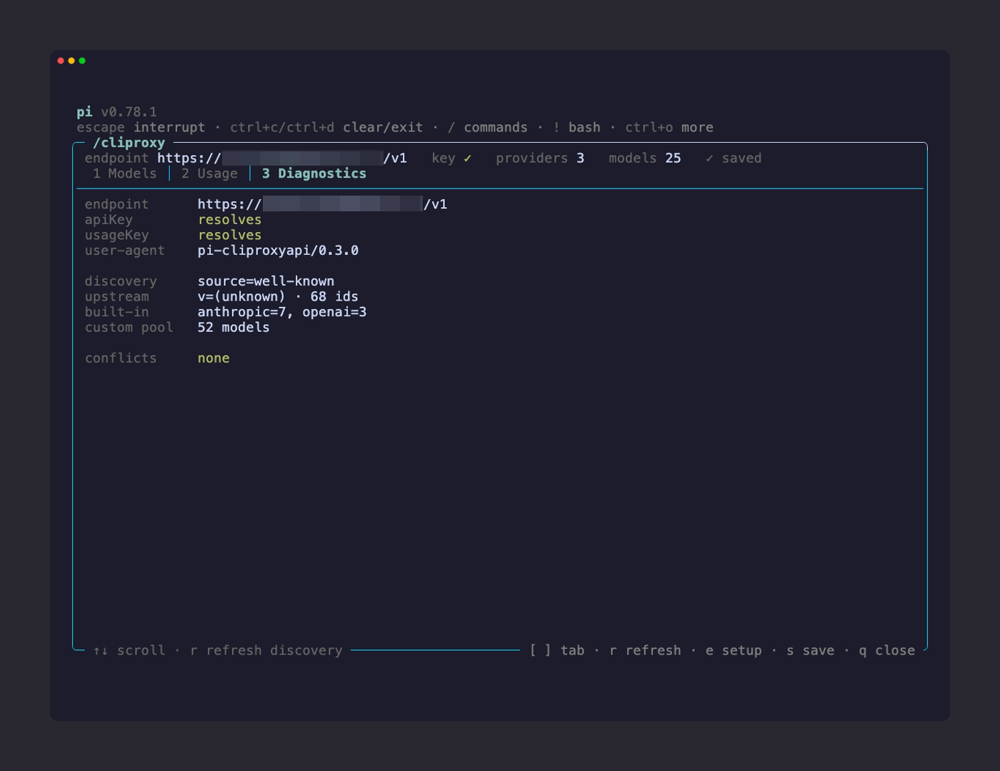

```
██████╗ ██╗     ██████╗██╗     ██╗██████╗ ██████╗  ██████╗ ██╗  ██╗██╗   ██╗
██╔══██╗██║    ██╔════╝██║     ██║██╔══██╗██╔══██╗██╔═══██╗╚██╗██╔╝╚██╗ ██╔╝
██████╔╝██║    ██║     ██║     ██║██████╔╝██████╔╝██║   ██║ ╚███╔╝  ╚████╔╝
██╔═══╝ ██║    ██║     ██║     ██║██╔═══╝ ██╔══██╗██║   ██║ ██╔██╗   ╚██╔╝
██║     ██║    ╚██████╗███████╗██║██║     ██║  ██║╚██████╔╝██╔╝ ██╗   ██║
╚═╝     ╚═╝     ╚═════╝╚══════╝╚═╝╚═╝     ╚═╝  ╚═╝ ╚═════╝ ╚═╝  ╚═╝   ╚═╝
```

# pi-cliproxyapi

[](https://www.npmjs.com/package/pi-cliproxyapi)
[](https://github.com/abix5/pi-cliproxyapi)

Pi extension for corporate management of model providers via a single [CliProxyAPI](https://github.com/router-for-me/CLIProxyAPI) endpoint.

One `(endpoint, apiKey)` pair — every provider and model inherits it automatically.



## Features

- **Unified hub** — one `/cliproxy` overlay with **Models / Usage / Diagnostics** tabs (number hotkeys `1` `2` `3`) plus global actions: `r` refresh, `e` setup, `s` save
- **Built-in provider routing** — whitelist which Anthropic / OpenAI / etc. models are available through the proxy
- **Custom provider groups** — create named groups (e.g. `corp-glm`, `corp-gemini`) for proxy-only models with automatic metadata from [models.dev](https://models.dev)
- **Exclusive model pool** — a model assigned to one group automatically disappears from others, grouped by `owned_by` with type-to-filter (`/`)
- **Live save state** — the header shows `● unsaved` while you edit and `✓ settings saved` after `s`, no console noise
- **Per-account usage tab** — colored quota bars, toggle disabled accounts, verbose errors — no LLM call
- **Setup wizard** — `/cliproxy-setup` configures endpoint, API key, provider prefix, and usage key interactively

## Commands

Two commands; everything else lives inside the hub as tabs and actions.

| Command | Description |
| --- | --- |
| `/cliproxy` | Hub overlay — **Models** / **Usage** / **Diagnostics** tabs plus global actions |
| `/cliproxy-setup` | Configure endpoint, API key, provider prefix, usage key |

### The `/cliproxy` hub

Global keys: `[` / `]` or `1` `2` `3` switch tabs · `r` refresh discovery + reapply · `e` setup · `s` save · `q` / `Esc` close.

**Models tab** — three panels cycled with `Tab` / arrows:

- **left** — every provider (built-in + custom). `+ new custom group…` is the last row.
- **right top** — models assigned to the focused provider. `Enter` / `Space` removes one.
- **right bottom** — available pool, grouped by upstream `owned_by`. `Enter` / `Space` attaches. Press `/` to filter the pool by id/name. A `⚠` marks an API mismatch (attach still allowed).

Extra Models keys: `d` removes a custom group (with confirmation).

**Usage tab** — per-account quota bars; `d` shows disabled accounts, `v` shows verbose errors.

**Diagnostics tab** — connectivity, key resolution, and discovery shape.

## Screenshots

**Models — custom group, pool grouped by owner (`/` filters the pool)**



**Usage — per-account quota windows**



**Diagnostics — connectivity, keys, discovery shape**



## Prerequisites

You need a running [CliProxyAPI](https://github.com/router-for-me/CLIProxyAPI) instance — this is the corporate LLM proxy that aggregates multiple providers behind a single OpenAI-compatible endpoint.

For full functionality (Usage tab, enriched model metadata from [models.dev](https://models.dev)), also deploy the companion sidecar: **[pi-cliproxyapi-wellknown](https://github.com/abix5/pi-cliproxyapi-wellknown)**. See [Deploying the sidecar](#deploying-the-sidecar-service) below.

## Install

```bash
pi install npm:pi-cliproxyapi
```

Then run `/cliproxy-setup` to configure your proxy endpoint.

## Config

`~/.config/pi-cliproxyapi/config.json` — created by `/cliproxy-setup`, editable by hand:

```jsonc
{
  "proxy": {
    "endpoint": "https://proxy.example.com/v1",
    "apiKey": "!cat ~/.config/pi-cliproxyapi/key",
    "providerPrefix": "corp",
    "usageKey": "!cat ~/.config/pi-cliproxyapi/usage-key"
  },
  "builtinProviders": {
    "anthropic": { "enabled": true, "models": ["claude-opus-4-7"] },
    "openai": { "enabled": true, "models": ["gpt-5.2"] }
  },
  "customProviders": {
    "corp-glm": {
      "api": "openai-completions",
      "models": [{ "id": "glm-4.7", "name": "GLM 4.7" }]
    }
  }
}
```

Values support `!command` (shell exec), `$ENV_VAR`, `~/path` (auto-wrapped to `!cat`), or literal strings.

## Discovery

The plugin tries `GET <endpoint-origin>/.well-known/pi` first (requires the sidecar). If unavailable, falls back to `GET <endpoint>/models` with local heuristics.

## Deploying the sidecar service

The **[pi-cliproxyapi-wellknown](https://github.com/abix5/pi-cliproxyapi-wellknown)** sidecar runs alongside CliProxyAPI and provides:

- `/.well-known/pi` — model discovery with metadata from [models.dev](https://models.dev) (context windows, costs, reasoning flags)
- `/api/usage` — per-account quota windows used by the hub Usage tab

```
┌──────────────┐     ┌───────────────────────────┐
│  Pi + plugin │────▶│  CliProxyAPI (:8317)      │
│              │     │  /v1/models, /v1/chat/... │
│              │     └───────────────────────────┘
│              │     ┌───────────────────────────┐
│              │────▶│  wellknown sidecar (:3458)│
│              │     │  /.well-known/pi          │
│              │     │  /api/usage               │
│              │     └───────────────────────────┘
└──────────────┘
```

### Quick start with Docker Compose

Clone the sidecar repo next to your CliProxyAPI deployment:

```bash
git clone https://github.com/abix5/pi-cliproxyapi-wellknown.git
```

Add to your `docker-compose.yml`:

```yaml
services:
  cliproxyapi:
    # ... your existing CliProxyAPI service ...

  pi-cliproxyapi-wellknown:
    build:
      context: ./pi-cliproxyapi-wellknown
    restart: unless-stopped
    ports:
      - "127.0.0.1:3458:3458"
    environment:
      UPSTREAM_MODELS_URL: http://cliproxyapi:8317/v1/models
      UPSTREAM_TOKEN: ${UPSTREAM_TOKEN}          # CliProxyAPI bearer key
      PI_PUBLIC_BASE_URL: ${PI_PUBLIC_BASE_URL}  # e.g. https://proxy.example.com/v1
      MANAGEMENT_API_URL: http://cliproxyapi:8317/v0/management
      MANAGEMENT_API_KEY: ${MANAGEMENT_API_KEY}
      PI_PLUGIN_USAGE_KEY: ${PI_PLUGIN_USAGE_KEY}  # shared with Pi plugin
    depends_on:
      cliproxyapi:
        condition: service_healthy
    networks:
      - your-network
```

Then route `/.well-known/pi` and `/api/usage` on your public domain to port 3458 via your reverse proxy (Nginx, Caddy, Cloudflare Tunnel, etc.).

### Connecting the plugin

Run `/cliproxy-setup` in Pi and enter:
- **endpoint** — your public proxy URL ending with `/v1`
- **apiKey** — CliProxyAPI bearer key
- **providerPrefix** — short slug for custom provider names (e.g. `corp`, `myproxy`)
- **usageKey** — same value as `PI_PLUGIN_USAGE_KEY` above (enables the Usage tab)

The sidecar is **optional for basic usage** — without it the plugin falls back to raw `/v1/models` with local heuristics. What changes:

| | With sidecar | Without sidecar |
| --- | --- | --- |
| Model discovery | Enriched from [models.dev](https://models.dev) (real context windows, costs, reasoning) | Defaults: `contextWindow=128k`, `maxTokens=16k`, `cost=0`, `reasoning=false` |
| Usage tab | Works — per-account quota bars | **Does not work** (no `/api/usage` endpoint) |
| Classification | Server-side, accurate | Local heuristics by `owned_by` |
| `/cliproxy` hub | Works | Works (Usage tab shows an error) |

## Layout

```
index.ts            ExtensionFactory entry point
src/
  config.ts         ~/.config/pi-cliproxyapi/config.json
  commands.ts       2 slash commands (hub + setup)
  apply.ts          pi.registerProvider calls
  fetch-models.ts   well-known + /v1/models fallback
  fetch-usage.ts    /api/usage client with TTL cache
  compat.ts         baseUrl derivation, model classification
  conflicts.ts      read-only ~/.pi/{models,auth}.json scan
  ui-frame.ts       single source of truth for overlay frames
  ui-setup.ts       setup wizard
  ui-usage.ts       ANSI-coloured usage renderer
  ui-hub/           the /cliproxy hub overlay
    index.ts        public runHub entry
    hub.ts          tabs, status header, global actions
    types.ts        HubView contract
    shell.ts        tab bar, status header, scroll/slice helpers
    view-models.ts  three-panel picker (single pool ordering + filter)
    view-usage.ts   usage tab (lazy fetch + d/v toggles)
    view-diagnostics.ts  diagnostics tab
  ui-picker/        picker building blocks reused by the Models view
    types.ts        shared TS types
    catalog.ts      build a model lookup from discovery
    providers.ts    resolve the providers shown in the left panel
    mutate.ts       attach / detach / claim + pool grouping + display order
    render-text.ts  ANSI-aware pad / truncate
    rows.ts         per-row renderers for left / right panels
    prompt-confirm.ts    remove-group confirmation
    prompt-name.ts       new-group name prompt
  log.ts            tagged logger
```
